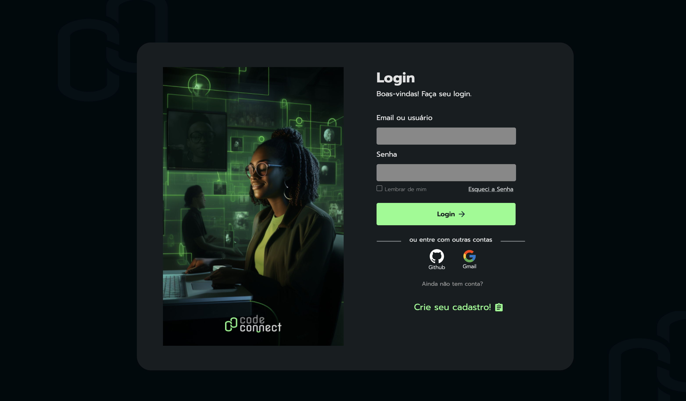

## Descrição do Projeto 

Projeto em andamento, sendo realizado por mim com intuito de praticar tudo que eu aprendi durante o curso de Front-End da Alura. Visando práticas de linguagens como HTML,CSS e JavaScript.O projeto é uma rede social para Desenvolvedores publicar e discutir projetos.

## Funcionalidade do Projeto 

- Funcionalidade `1` - Cadastro: O usuário deve se cadastrar para poder criar o seu perfil na rede. O cadastro contem informações simples e com uma frase para lembrar a sua senha, caso seja esquecida.

- Funcionalidade `2`- Perfil: Na navegação da pagina do perfil, é possivel selecionar a foto de perfil, fazer uma breve descrição sobre si , e caso queira, pode alterar o NickName cadastrado. Caso, altere, não sera alterada forma de fazer o login. Além disso, é possivel ver os projetos que publicou e quais foram compartilhados.Os usuários podem seguir o seu perfil para ver as suas conexões e atualizações com mais facilidade.

- Funcionalidade `3`- Publicar Projeto: Depois que feito o perfil, agora é possivel publicar o projeto para ser visualizado na CodeConnect. Depois de responder as questões basicas do projeto, como descrição, titulo,tag e inserir a imagem, o projeto pode ser publicado e será visto tanto no feed para todos os usuarios da rede, como em seu perfil para edições, caso seja necessário.

- Funcionalidade `4`- Feed: O Feed concentra todos os projetos publicados pelos usuaários, podendo acessar o projeto ao clicar em seu card para ver o projeto de forma mais detalhada e caso queira, é possivel comentar e compartilhar o projeto.

- Funcionalidade `5`- Projeto Publicado: Quando o projeto é publicado, é possivel editar e demonstrar mais detalhes sobr ele.Além dos usuários poderem interagir e comentar com você sobre o projeto.

- Funcionalidade `6` - Sair: A qualquer momento você pode sair e entrar da CodeConnect e suas informações.

## Técnicas e Tecnologias utilizadas

- ``JavaScript``
- ``HTML``
- ``CSS``
- ``Uso de módulos (import e export) para organização e reutilização de arquivos e funções;``
- ``Armazenamento de dados no LocalStorage para manter informações como atividades e cadastros de login, mesmo após o fechamento da página;``
- ``Design responsivo com suporte para versões Desktop, Mobile e Tablet;``
- ``Utilização do método filter para manipulação e recuperação de informações no LocalStorage;``
- ``Manipulação eficiente do DOM para interatividade e atualização da interface;``
